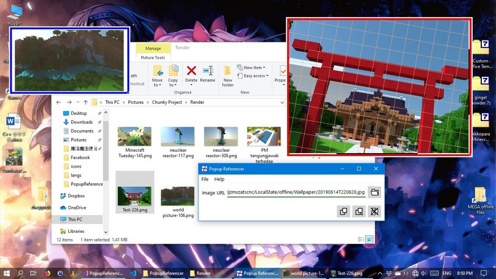
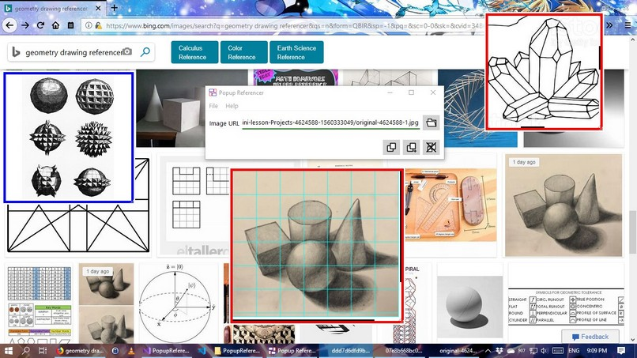

# Popup Referencer

Popup Referencer is a little utility that pin all reference images on very top of the screen. The utility
support both local and online picture.

## Feature

 - Pin reference images on top of screen via popups.
 - Simple popup for simple/quick reference.
 - Advance popup for more advance features include:
	 - Zoom
	 - Rotate
	 - Overlay grids
 - Load images from local or online.
 - Drag and drop from file explerer or browser.
 - Support common images format as bellow:
	 - JPG/JPEG
	 - PNG
	 - GIF

## Main Project License
This project is licensed under [The Mozilla Public License 2.0](LICENSE).

## Depenencies And 3rd Party License

|Name|License|URL|
|:---|:---|:---|
|Qt5 Gui Framework|LGPL v3|https://www.qt.io|

Licenses and 3 party notice are located under "3rd party notices" folder.